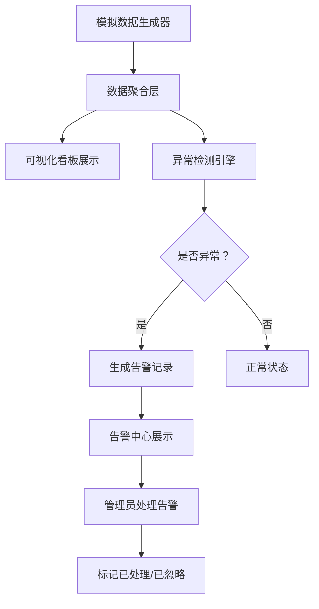

## 1. 产品概述

宿舍用水用电数据可视化与异常提醒系统，帮助宿管人员和学生实时监控水电消耗情况，及时发现异常用水用电行为。

- 通过模拟数据展示各宿舍楼/房间的水电消耗趋势，提供直观的数据可视化看板
- 自动检测异常消耗（如用水量突增、用电量异常等）并生成提醒通知

## 2. 核心功能

### 2.1 用户角色
| 角色 | 登录方式 | 核心权限 |
|------|----------|----------|
| 宿管管理员 | 无需登录（本地系统） | 查看所有宿舍数据、管理异常告警、查看统计报表 |
| 普通学生 | 无需登录（本地系统） | 查看本楼栋数据概览 |

### 2.2 功能模块
1. **数据概览看板**：全局水电数据总览、关键指标卡片、趋势图
2. **楼栋详情页**：各宿舍楼的水电数据明细、逐房间数据对比
3. **异常告警中心**：实时异常提醒、历史告警记录、告警处理

### 2.3 页面详情
| 页面名称 | 模块名称 | 功能描述 |
|----------|----------|----------|
| 数据概览看板 | 指标卡片 | 显示总用水量、总用电量、本月费用、异常数量等关键指标 |
| 数据概览看板 | 趋势图表 | 近7天/30天水电消耗趋势折线图 |
| 数据概览看板 | 楼栋对比 | 各宿舍楼水电消耗柱状对比图 |
| 数据概览看板 | 异常概览 | 最新异常告警滚动列表 |
| 楼栋详情页 | 房间列表 | 展示选定楼栋的所有房间水电数据表格 |
| 楼栋详情页 | 数据图表 | 单个房间的水电消耗明细图表 |
| 楼栋详情页 | 占比分析 | 水电消耗的环形占比图 |
| 异常告警中心 | 告警列表 | 所有异常告警的分页列表，按时间倒序 |
| 异常告警中心 | 告警过滤 | 按类型（用水异常/用电异常）、楼栋、时间范围筛选 |
| 异常告警中心 | 告警处理 | 标记告警为"已处理"或"忽略" |

## 3. 核心流程

模拟数据生成 → 数据聚合统计 → 异常检测引擎分析 → 可视化展示

## 4. 用户界面设计

### 4.1 设计风格
- **主色调**：深蓝(#0a1628)为主背景，青色(#00d4ff)为数据高亮色，橙色(#ff6b35)为异常警告色
- **按钮风格**：简洁的圆角矩形，带微光效悬停效果
- **字体**：系统字体 + 等宽字体用于数据显示
- **布局风格**：卡片式布局，深色主题科技感风格，营造监控中心氛围
- **动效风格**：数据加载时的微动效，图表入场动画，告警闪烁效果

### 4.2 页面设计概览
| 页面名称 | 模块名称 | UI元素 |
|----------|----------|--------|
| 数据概览看板 | 指标卡片 | 毛玻璃效果卡片、大号数字、趋势箭头图标 |
| 数据概览看板 | 趋势图表 | 交互式折线图、可切换时间范围 |
| 数据概览看板 | 楼栋对比 | 柱状图、横向排列、不同颜色区分水电 |
| 数据概览看板 | 异常概览 | 滚动列表、红色异常标记、时间戳 |
| 楼栋详情页 | 楼栋选择器 | Tab切换标签或下拉选择器 |
| 楼栋详情页 | 数据表格 | 排序表格、条件格式（超标标红） |
| 楼栋详情页 | 占比分析 | 环形图、图例标注 |
| 异常告警中心 | 告警列表 | 卡片式列表、严重程度颜色标记、操作按钮 |
| 异常告警中心 | 筛选区域 | 下拉选择、日期选择器、筛选按钮 |

### 4.3 响应式设计
- 桌面优先设计，最低支持 1280px 宽度
- 图表在 1024px 以下自动堆叠显示
- 移动端做基础适配（可选）
