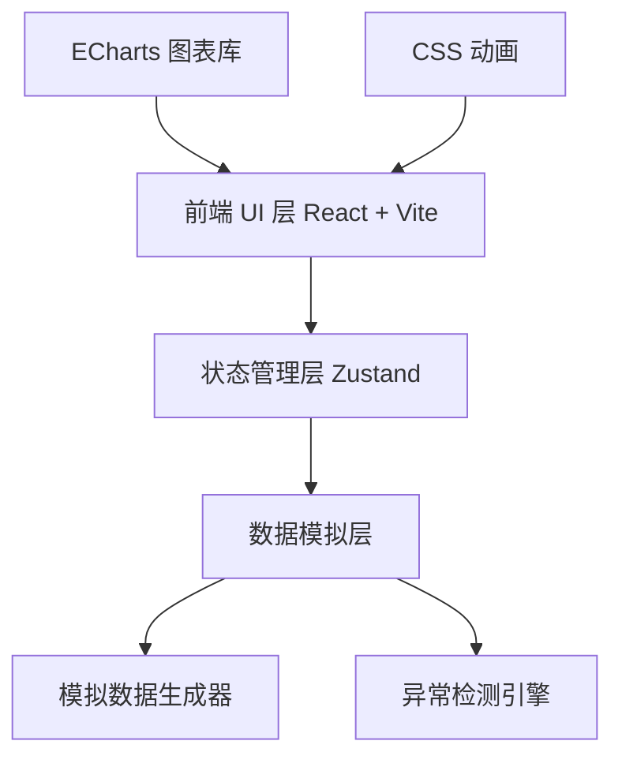
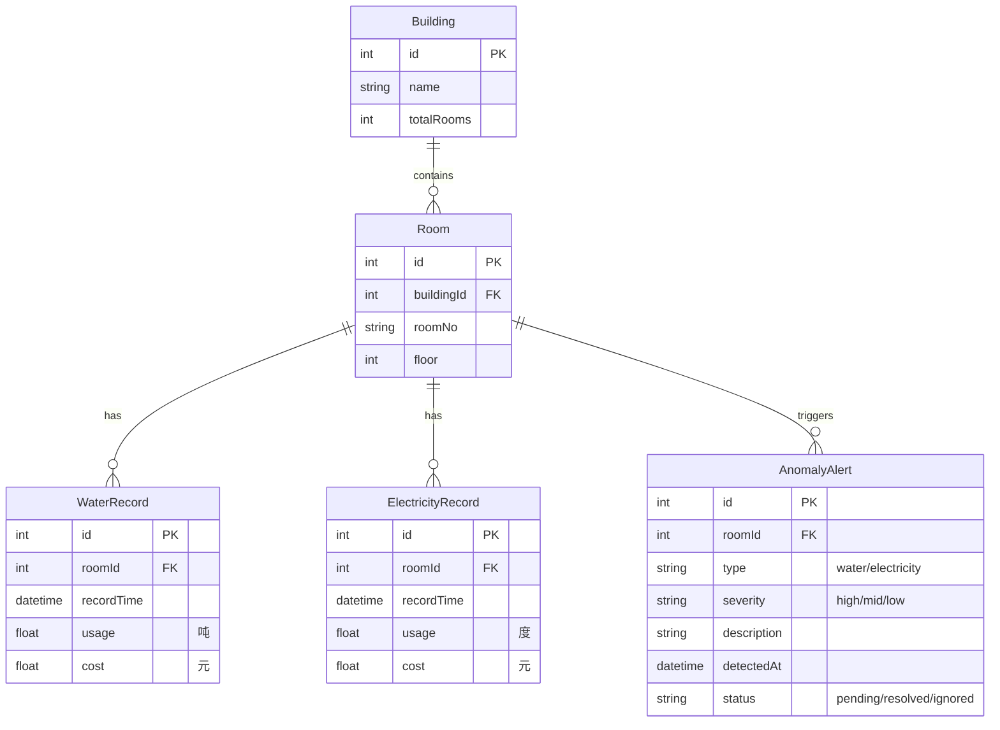

## 1. 架构设计



## 2. 技术说明

- **前端框架**：React@18 + TypeScript + Vite
- **初始化工具**：vite-init
- **CSS 方案**：Tailwind CSS v3 + 自定义 CSS 变量
- **图表库**：ECharts + echarts-for-react
- **状态管理**：Zustand
- **数据方案**：前端模拟数据（无后端服务）
- **包管理**：npm

## 3. 路由定义

| 路由 | 页面 | 说明 |
|------|------|------|
| / | 数据概览看板 | 系统首页，全局数据看板 |
| /dormitory/:id | 楼栋详情页 | 查看指定楼栋的详细数据 |
| /alerts | 异常告警中心 | 异常告警列表与处理 |

## 4. 前端组件架构

| 组件名称 | 层级 | 功能描述 |
|----------|------|----------|
| Layout | 布局 | 侧边导航 + 顶部栏 + 内容区 |
| StatCard | 通用 | 指标卡片组件，显示数字、趋势、图标 |
| TrendChart | 图表 | 折线趋势图，支持时间范围切换 |
| BuildingCompare | 图表 | 楼栋对比柱状图 |
| RoomTable | 数据展示 | 房间水电数据表格，支持排序 |
| DonutChart | 图表 | 环形占比图 |
| AlertList | 数据展示 | 告警列表组件 |
| AlertFilter | 筛选 | 告警筛选条件区域 |
| AnomalyBanner | 通用 | 异常滚动提示条 |

## 5. 数据模型

### 5.1 数据模型定义



### 5.2 模拟数据结构

**Building（宿舍楼）**
```typescript
interface Building {
  id: number;
  name: string;
  totalRooms: number;
}
```

**Room（房间）**
```typescript
interface Room {
  id: number;
  buildingId: number;
  roomNo: string;
  floor: number;
}
```

**WaterRecord & ElectricityRecord（水电记录）**
```typescript
interface UtilityRecord {
  id: number;
  roomId: number;
  recordTime: string; // ISO datetime
  usage: number;      // 用水：吨；用电：度
  cost: number;       // 费用
}
```

**AnomalyAlert（异常告警）**
```typescript
interface AnomalyAlert {
  id: number;
  roomId: number;
  type: 'water' | 'electricity';
  severity: 'high' | 'mid' | 'low';
  description: string;
  detectedAt: string;
  status: 'pending' | 'resolved' | 'ignored';
}
```

## 6. 异常检测规则

| 异常类型 | 检测条件 | 严重程度 |
|----------|----------|----------|
| 用水突增 | 单日用水量超过前7天平均值的200% | high |
| 用电突增 | 单日用电量超过前7天平均值的200% | high |
| 用水偏高 | 单日用水量超过前7天平均值的150% | mid |
| 用电偏高 | 单日用电量超过前7天平均值的150% | mid |
| 持续高消耗 | 连续3天用水/用电超过平均值130% | low |
